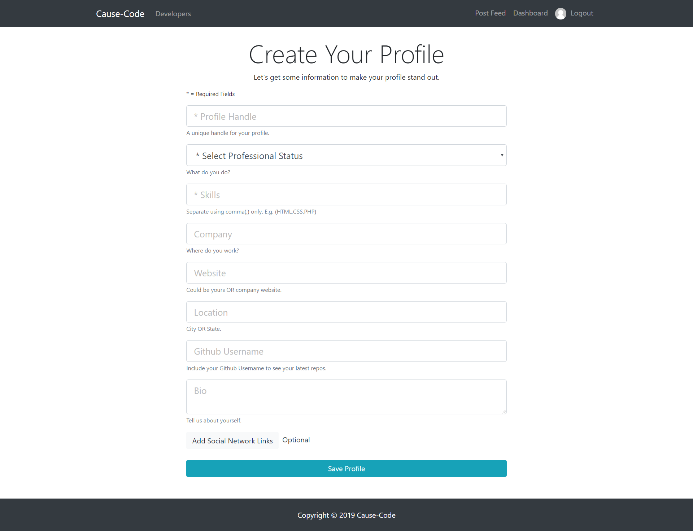
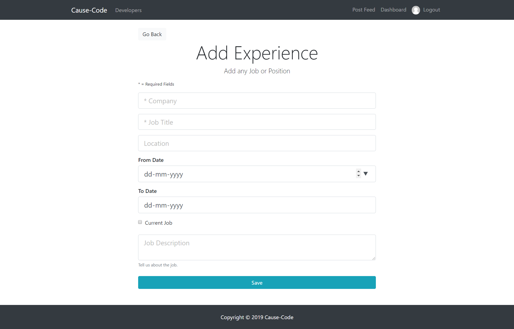
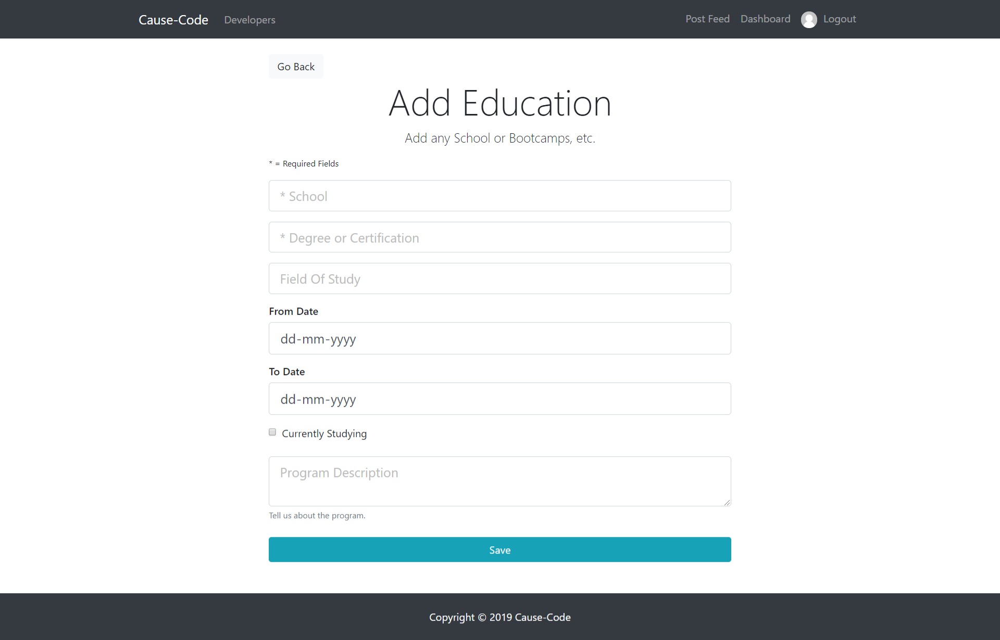
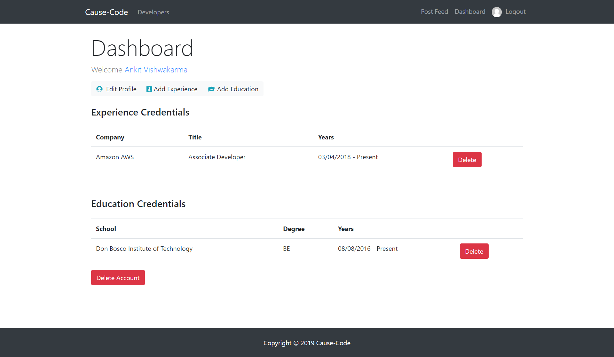
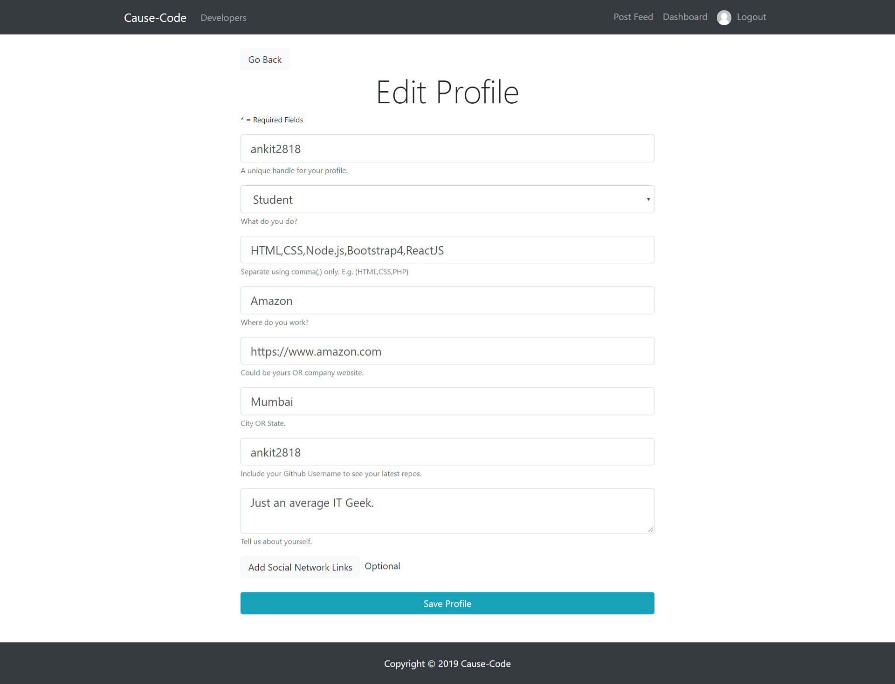
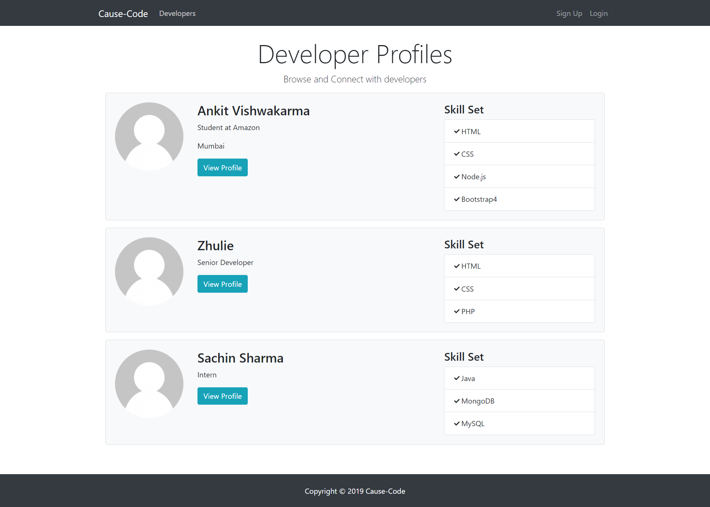
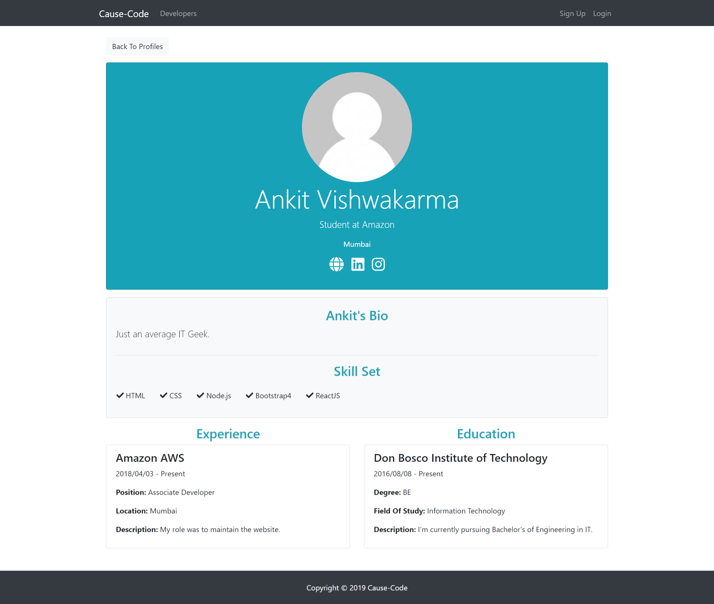
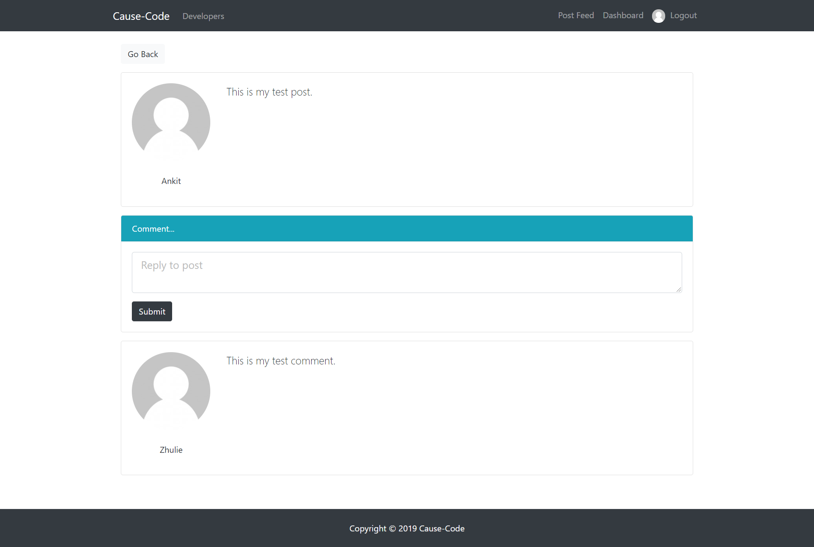

# Cause-Code Social Network

# DEMO

#### [YouTube](https://youtu.be/KcZB988gnmU)

## ⛏️ Built With 

- [MongoDB](https://www.mongodb.com/)
- [Express](https://expressjs.com/)
- [NodeJs](https://nodejs.org/en/)
- [BootStrap 4](https://getbootstrap.com/)
- [ReactJS](https://reactjs.org/)
- [Redux](https://redux.js.org/)

### Get started:

- Clone this repo: `git clone https://github.com/ankit2818/cause-code.git`
- Change directory: `cd cause-code`
- Install required modules for server: `npm install`
- Install required modules for client: `npm run client-install`
- To run development server: `npm run dev`\
  Server should be started on `Localhost:5000` and client server should be started on [Localhost:3000](http://localhost:3000/api/users/register)

### Configuration:

Replace the **mongoURI** in `/config/keys.js` with URI of your database.
Replace the **secretOrKey** in `/config/keys.js` with your own secret key.

## 🧐 CauseCode Coding Challenge 

### Fullstack

    1) Create an inventory management platform for { pick an industry, product or service }. For example, inventory management for TVs.
    2) Create a small social network
    3) Find a website with public profiles and write a scraper to scrape those profiles
    4) Create a realtime video/audio/text chat application

## 🧐 Problem Statement Selected 

    2) Create a small social network

# Commit history to see how your work evolved

- [See Commit History](https://github.com/ankit2818/cause-code/commits/master/)

# Screenshots 

</img>
</img>
</img>
</img>
</img>
</img>
</img>
</img>
</img>
</img>
</img>
</img>
</img>

# Features:

    Registration and Login
        • User will have to register themselves by providing basic information such as name and email about them and then they can login into the system.
        • Once users have logged in, users will be able to post, like other's post and comment.

# Functionality

    ❖ Registration
    ❖ Login
    ❖ Update your personal details anytime
    ❖ Create posts, like posts, comment
    ❖ Shows Number of likes and all comments
    ❖ Onclick post, single page view of post with all the comments in it
    ❖ Dashboard which shows the records of user

## ✍️ Author 

- [@Ankit Vishwakarma](https://github.com/ankit2818) - Cause-Code
